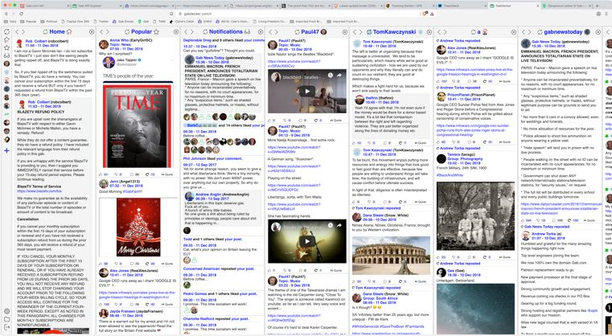
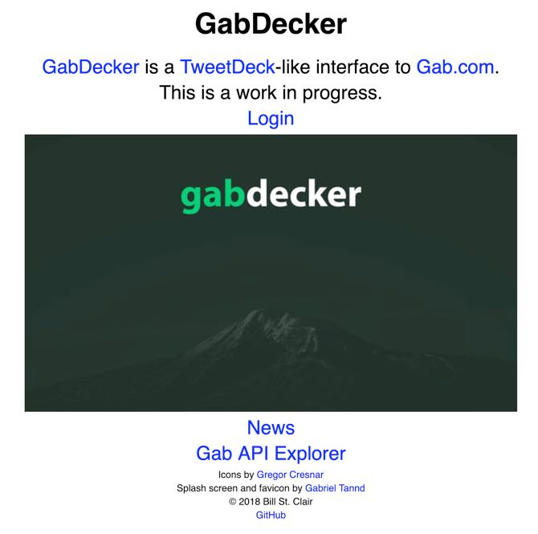
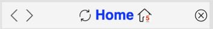

# GabDecker User Guide

[GabDecker](https://gabdecker.com) uses the [Gab API](https://developers.gab.com/) to provide multiple feeds on one screen.

When you first go to the site, you'll see the splash screen/login page.

Click the "Login" button, and you'll be directed to Gab's authentication web page, where you may enter a Gab userid and password. You'll be directed back to GabDecker, and the received access token will be stored in your browser's local storage, so that next time you visit with the same browser, you won't need to login again.

The columns are called "feeds". When you first login, you'll have four feeds, "Home", "Notification", "Popular", and Andrew Torba's user feed ("a"). A feed's name appears at the top of its column and in the "control column", on the left. If you have more feeds than will fit in the horizontal size of your browser window, clicking on the control column icon for an invisible feed will scroll it into view.

There are four buttons, a link, a name, an icon, and sometimes a new post count in a feed column header:

The left arrow button moves this feed's column one space to the left.

The right arrow button moves this feed's column one space to the right.

The refresh button (a circle made up of two curved arrows) refreshes this feed with new posts.

The name and the icon next to it (which will be the user's profile photo for a user feed) are a link that opens a new browser tab to the feed on Gab.com.

The close button (circle with an x inside), removes the feed's column (and adds it to the "Add Feed" dialog as the "Last Closed" feed).

